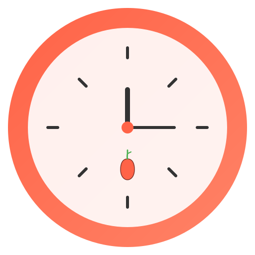

# Pomodoro Timer

A beautiful and intuitive Pomodoro Timer desktop application built with Tauri, Svelte, and Vite. This app follows Apple's design principles, creating a clean, minimalist interface that's both beautiful and functional.



## Features

- 🍅 Pomodoro, Short Break, and Long Break timers
- 🎯 Focus on one task at a time
- 🔔 Desktop notifications when timers complete
- 🎨 Clean, minimalist Apple-inspired design
- 🌙 Light and dark mode support
- 🖱️ Drag-and-drop window positioning
- 📊 Track completed Pomodoros

## Usage

The Pomodoro Technique is a time management method that uses a timer to break work into intervals, traditionally 25 minutes in length, separated by short breaks. This app implements this technique with:

1. **Focus Time (25 minutes)** - Work on your task without distractions
2. **Short Break (5 minutes)** - Take a quick break
3. **Long Break (15 minutes)** - Take a longer break after 4 Pomodoro sessions

## Development

This app is built using:

- [Tauri](https://tauri.app/) - Lightweight, secure desktop application framework
- [Svelte](https://svelte.dev/) - Component-based UI framework
- [Vite](https://vitejs.dev/) - Fast build tooling

### Running Locally

1. Install dependencies:
   ```bash
   npm install
   ```

2. Start the development server:
   ```bash
   npm run tauri:dev
   ```

### Building for Production

```bash
npm run tauri:build
```

This will create platform-specific installers in the `src-tauri/target/release/bundle` directory.

## License

MIT

**Why enable `checkJs` in the JS template?**

It is likely that most cases of changing variable types in runtime are likely to be accidental, rather than deliberate. This provides advanced typechecking out of the box. Should you like to take advantage of the dynamically-typed nature of JavaScript, it is trivial to change the configuration.

**Why is HMR not preserving my local component state?**

HMR state preservation comes with a number of gotchas! It has been disabled by default in both `svelte-hmr` and `@sveltejs/vite-plugin-svelte` due to its often surprising behavior. You can read the details [here](https://github.com/sveltejs/svelte-hmr/tree/master/packages/svelte-hmr#preservation-of-local-state).

If you have state that's important to retain within a component, consider creating an external store which would not be replaced by HMR.

```js
// store.js
// An extremely simple external store
import { writable } from 'svelte/store'
export default writable(0)
```
